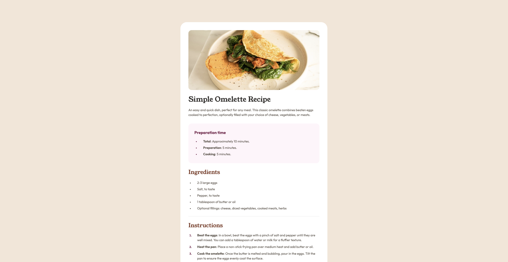
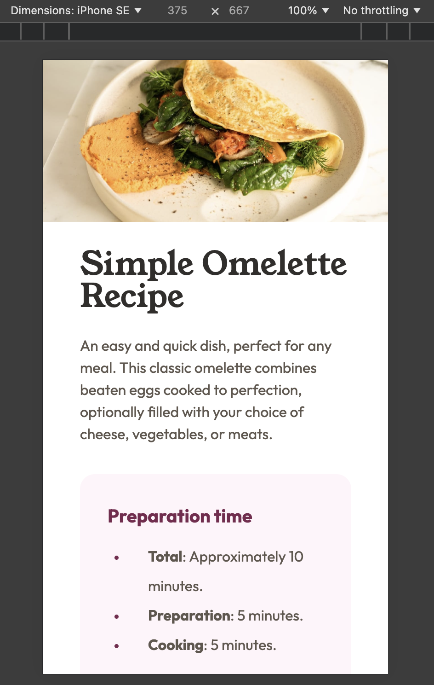

# Frontend Mentor - Recipe page solution

This is a solution to the [Recipe page challenge on Frontend Mentor](https://www.frontendmentor.io/challenges/recipe-page-KiTsR8QQKm). Frontend Mentor challenges help you improve your coding skills by building realistic projects.

## Table of contents

- [Overview](#overview)
  - [The challenge](#the-challenge)
  - [Screenshot](#screenshot)
  - [Links](#links)
- [My process](#my-process)
  - [Built with](#built-with)
  - [What I learned](#what-i-learned)
  - [Continued development](#continued-development)
- [Author](#author)

## Overview

### Screenshots

### Links

- Solution URL: [Vercel](https://project-recipe-page-xi.vercel.app/)

## My process
I slowly built HTML and CSS, then I tested responsiveness.

### Built with

- Semantic HTML5 markup
- Flexbox

### What I learned

I learned to style CSS lists better, and make my pages more responsive, changing entire the layout on mobile.

### Continued development

I want to be able to master responsive design, particularly making images more responsive.

## Author

- Frontend Mentor - [@yarsvent](https://www.frontendmentor.io/profile/yarsvent)
